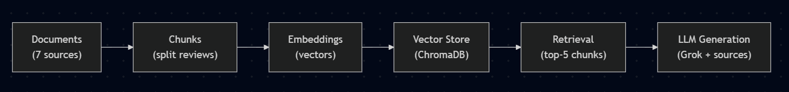

# Project 1 Planning: The Unofficial Guide

> Write this document before you write any pipeline code.
> Your spec and architecture diagram are what you'll use to direct AI tools (Claude, Copilot, etc.) to generate your implementation — the more specific they are, the more useful the generated code will be.
> Update the Retrieval Approach and Chunking Strategy sections if you change your approach during implementation.
> Update this file before starting any stretch features.

---

## Domain

<!-- What domain did you choose? Why is this knowledge valuable and hard to find through official channels? -->

**Domain:** Student experiences with Professor Alexa (Alex) Doboli's courses (ESE 124, 224, 344) at Stony Brook University.

This knowledge is valuable to students deciding whether to take Professor Doboli or how to prepare for his courses, but it is scattered and hard to find through official channels. The university only publishes a faculty bio and aggregate course-evaluation numbers — it doesn't surface the actual qualitative experience: what the lectures are like, how the labs and final project really go, how the AI/self-learning teaching style lands, and how the courses compare to each other. That candid information lives across Rate My Professors, official course-evaluation comments, and several scattered Reddit threads. A RAG system consolidates these perspectives into one place so a student can ask a direct question and get an answer grounded in real reviews.

---

## Documents

<!-- List your specific sources: URLs, subreddit names, forum threads, or file descriptions.
     Aim for at least 10 sources that together cover different subtopics or perspectives within your domain. -->

| # | Source | Description | URL or location |
|---|--------|-------------|-----------------|
| 1 | Rate My Professors | 35 student ratings of Prof. Doboli with quality/difficulty scores and written reviews across his courses | documents/dobolirmp_cleaned.txt |
| 2 | SBU Official Course Evaluation — ESE 124 | Student evaluation comments on the intro C programming course (what was valuable / what could improve) | documents/doboliese124_cleaned.txt |
| 3 | SBU Official Course Evaluation — ESE 224 | Student evaluation comments on the C++/data-structures course | documents/doboliese224_cleaned.txt |
| 4 | SBU Official Course Evaluation — ESE 344 | Student evaluation comments on the data structures & algorithms course | documents/doboliese344_cleaned.txt |
| 5 | Reddit r/SBU — single-student review | One student's reviews of all three Doboli courses (ESE 124/224/344) with ratings | documents/doboliclasses_cleaned.txt |
| 6 | Reddit r/SBU — teacher rating thread | Comments discussing Prof. Doboli's teaching style and which courses he teaches | documents/dobolireddit1_cleaned.txt |
| 7 | Reddit r/SBU — "Dear Alex Doboli" thread | Open-letter post about the AI/self-learning teaching style, plus a TA response | documents/dobolireddit2_cleaned.txt |
| 8 | Reddit r/SBU — "The new ESE 124 Professor" thread | Positive thread praising Doboli vs. other professors, with alumni/TA comments | documents/doboliredditgood.txt |
| 9 | Reddit r/SBU — "ESE124 — Doboli" thread | Mixed/neutral thread on the pre/post-COVID experience, with alumni and TA replies | documents/doboliredditneutral.txt |
| 10 | SBU Faculty Page | Factual background: appointment, education, research record, publications, h-index | documents/alexdooli.txt |

---

## Chunking Strategy

<!-- How will you split documents into chunks?
     State your chunk size (in tokens or characters), overlap size, and explain why those
     numbers fit the structure of your documents.
     A review-heavy corpus warrants different chunking than a long FAQ. -->

**Chunk size:**
1 review/comment per chunk(Anywhere between 100-400 tokens)
**Overlap: 0**

**Reasoning:**
The documents consists of seperate reviews and comments from Reddit, Classie Evaluations, and RateMyProfessor. Each review is treated as its own chunk because it usually contains a complete opinion or experience. An overlap of 0 tokens is used since the reviews are not part of a continuous thought, and do not rely on surrounding chunks for context. This reduces duplicate information while improving retrieval precision by returning the most relevant reviews directly.
---

## Retrieval Approach

<!-- Which embedding model are you using (e.g., all-MiniLM-L6-v2 via sentence-transformers)?
     How many chunks will you retrieve per query (top-k)?
     If you were deploying this for real users and cost wasn't a constraint, what tradeoffs
     would you weigh in choosing a different embedding model — context length, multilingual
     support, accuracy on domain-specific text, latency? -->

**Embedding model:**
all-MiniLM-L6-v2
**Top-k:**
k=5
**Production tradeoff reflection:**
all-MiniLM-L6-v2 was chosen because it is lightweight, fast, and provides strong semantic search performance for short text documents such as student reviews and comments. A top-k value of 5 balances retrieval quality and context size by returning enough relevant reviews without introducing excessive noise. In a production environment, larger embedding models could improve retrieval accuracy, especially for more complex or domain-specific queries, but would increase computational cost and latency.
---

## Evaluation Plan

<!-- List your 5 test questions with their expected correct answers.
     Questions should be specific enough that you can judge whether the system's response
     is right or wrong. "What are good dining halls?" is too vague.
     "What do students say about wait times at [dining hall name] during lunch?" is testable. -->

| # | Question | Expected answer |
|---|----------|-----------------|
| 1 |What are students general opinion on Professor Doboli? |Mixed-Negative. Some students say hes knoledgable and caring, but that his teaching style is hard to follow and is difficult for beginners |
| 2 |Is ESE 124 with Doboli beginner-friendly? |Generally no, Professor Doboli teaches like you should know the class beforehand |
| 3 |What are the biggest complaints of Professor Dobolis classes? |Unclear lectures, heavy reliance on self learning, and a pace not suitable for beginners |
| 4 |How do students compare ESE 224 and 124 with Professor Doboli? |224 is just like 124, with slightly harder content and more focused on data structures. |
| 5 |What is valuable about ESE124 with Professor Doboli? |Learning C fundamentals is nice, his labs give good hands-on support, and the final project connects things together. |

---

## Anticipated Challenges

<!-- What could go wrong? Name at least two specific risks with reasoning.
     Consider: noisy or inconsistent documents, missing source attribution, off-topic
     retrieval, chunks that split key information across boundaries. -->

1. Many students joke around and say random things about the professor. THis could cause issues in the retrieval, as the RAG may pick those jokes up to be actual reviews and put them as the answer. Also many emojis in play so that may cause an issue.

2. It is an overall negative response. Even though there is some good, variation isn't very high, so the RAG will only have negative information to pull from.

---

## Architecture

<!-- Draw a diagram of your pipeline showing the five stages:
     Document Ingestion → Chunking → Embedding + Vector Store → Retrieval → Generation
     Label each stage with the tool or library you're using.
     You can use ASCII art, a Mermaid diagram, or embed a sketch as an image.
     You'll use this diagram as context when prompting AI tools to implement each stage. -->

---

## AI Tool Plan

<!-- For each part of the pipeline below, describe:
     - Which AI tool you plan to use (Claude, Copilot, ChatGPT, etc.)
     - What you'll give it as input (which sections of this planning.md, which requirements)
     - What you expect it to produce
     - How you'll verify the output matches your spec

     "I'll use AI to help me code" is not a plan.
     "I'll give Claude my Chunking Strategy section and ask it to implement chunk_text()
     with my specified chunk size and overlap" is a plan. -->

**Milestone 3 — Ingestion and chunking:**
Tool: ChatGPT
Input: The documents folder and the chunking strategy in planning.md.
Expected output: chunk_documents.py that reads all .txt files from the documents folder, splits each one on --- separators to produce one chunk per review, and saves everything to data/chunks.json with the text, source filename, and chunk ID for each chunk.
Verification: run python chunk_documents.py and confirm 53 chunks are produced across all 10 sources, then print 5 random samples and check that each one is a readable, self-contained review with no leftover HTML or boilerplate headers.

**Milestone 4 — Embedding and retrieval:**
Tool: Claude Code
Input: My retrieval approach section and the pipeline diagram.
Expected output: embed_and_retrieve.py that embeds all chunks using all-MiniLM-L6-v2, stores them in a ChromaDB collection with source metadata, and a retrieve() function that returns the top 5 chunks with their text, source filename, and distance score.
Verification: run the 5 evaluation questions through retrieval and confirm the returned chunks are relevant and on-topic with distance scores below 0.5.

**Milestone 5 — Generation and interface:**
Tool: Claude Code
Input: My retrieval approach section, the architecture diagram (Retrieval → LLM Generation), and the grounding requirement (answers from retrieved reviews only, with source attribution).
Expected output: app.py that passes the top-5 retrieved chunks to Groq's llama-3.3-70b-versatile with a system prompt that forces grounding (answer only from the provided reviews; say "I don't have enough information" otherwise), builds the source list programmatically from chunk metadata, and serves a Gradio interface (answer + source list).
Verification: run the 5 evaluation questions through the pipeline and compare against expected answers; confirm an off-topic question triggers the "not enough information" refusal instead of a hallucinated answer.
